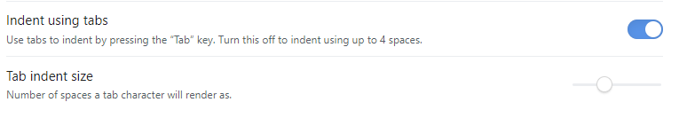

# Obsidian Tab Key Plugin
Restore tab key behaviour: tab key inserts a tab, the way it should be.

solves problem in this forum thread: https://forum.obsidian.md/t/tab-key-only-indents-not-makes-script-block/4754

Tabs/indentation respects Obsidian app options below

[suggested by huyz](https://github.com/jrymk/obsidian-tab-key/issues/1)
