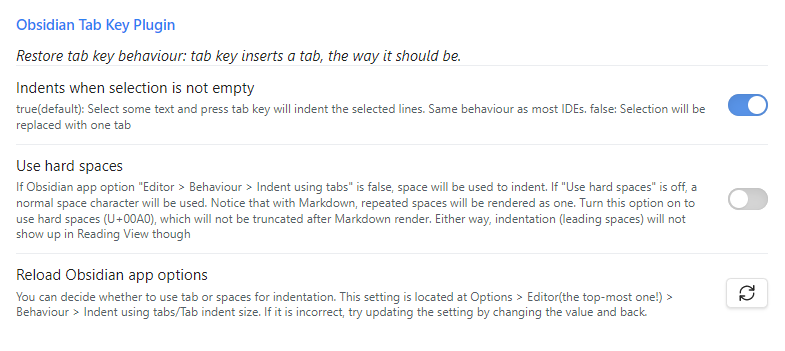
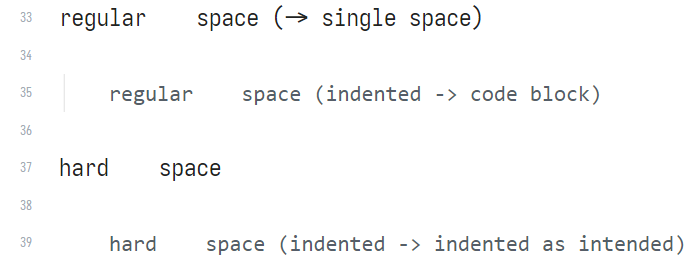
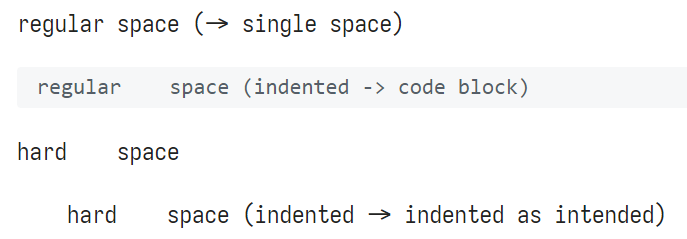

# Obsidian Tab Key Plugin
Restore tab key behaviour: tab key inserts a tab, the way it should be.

To summarize, **this plugin make the tab key insert tabs** (if nothing selected), **without affecting the ability to quickly indenting lines** (if some text selected), just like most IDEs. In addition, it allows you to insert hard spaces quickly if you want a wide blank inside text. Also it allows you to use, for example, 2 spaces for tab, which you might want when editing code blocks.

it solves the problem mentioned in this forum thread: https://forum.obsidian.md/t/option-to-disable-tab-to-indent/40868

---

\
The tab key now works just like any other IDE. If you select some text and press tab, the selected lines will be indented. If nothing is selected, a tab will be inserted. There is also an option to insert tab regardless.

### Indent using tabs
Select some text and press tab to indent, like just about any IDE.\
The indent action is completely unaltered, you can change "Indent using tabs" and "Tab indent size" in Editor settings to change that behavior.

### Hard space
Hard spaces (U+00A0) as tab allows you to insert wide blanks inside text. Without using hard spaces, repeated spaces (and tabs) will be rendered as one single space. You can toggle whether to use hard space instead of regular spaces.\
You can insert hard spaces in the beginning of a line to act like indentation. You will have to move the cursor to the beginning and press tab to insert them though. **Indenting (select text and press tab) will not insert hard spaces.**

live preview/source view: (Yes, with hard spaces as indentation it still turns into a code block. Aaargh!)\
\
after render (reading view):\

